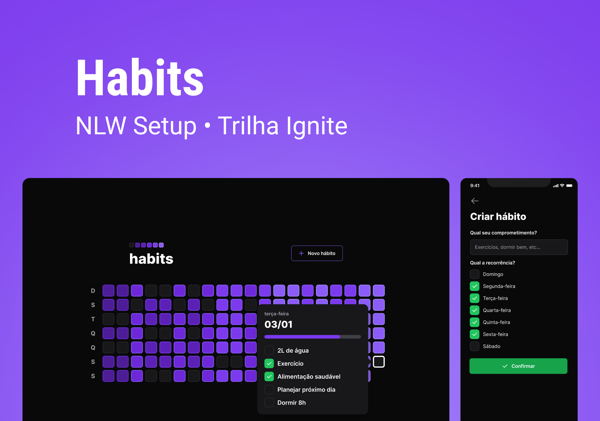

# Habits - NLW 2023 (Ignite)

  
  
  



> The “Habits” Project was developed during the 1st edition of the NLW (Next Level Week) of 2023. In which both the backend, frontend web and mobile were developed.

<br></br>

## 🧪 Technologies

This project was developed using the following technologies:

- [NodeJS](https://nodejs.org/)
- [TypeScript](https://www.typescriptlang.org/)
- [Fastify](https://www.fastify.io/)
- [Prisma](https://www.prisma.io/)
- [ViteJS](https://vitejs.dev/)
- [ReactJS](https://reactjs.org/)
- [TailwindCSS](https://tailwindcss.com/)
- [React Native](https://reactnative.dev/)
- [Expo](https://expo.io/)


<br></br>

## 💻 Prerequisites

Before you begin, make sure you've met the following requirements:

- You have installed the latest version of `Node.js`
- Compatible with all operating systems: Windows, Linux and Mac.
- You must read the project documentation.


<br></br>

## 🚀 Getting started

Clone the project and access the folder.

```bash
$ git clone https://github.com/leticiar-io/NlwSetup_TrilhaIgnite.git
$ cd NlwSetup_TrilhaIgnite
```

Follow the steps below:

### Web

```bash
# Install the web dependencies
$ cd web
$ npm install
# Start the web project
$ npm start
```

### Server

```bash
# Install the server dependencies
$ cd server
$ npm install
# Start the server project
$ npx prisma migrate deploy
$ npm run dev
```

### Mobile

```bash
# Install the mobile dependencies
$ cd mobile
$ npm install
# Start the mobile project
$ npm start
```

[⬆ Back to top](#habits)<br>